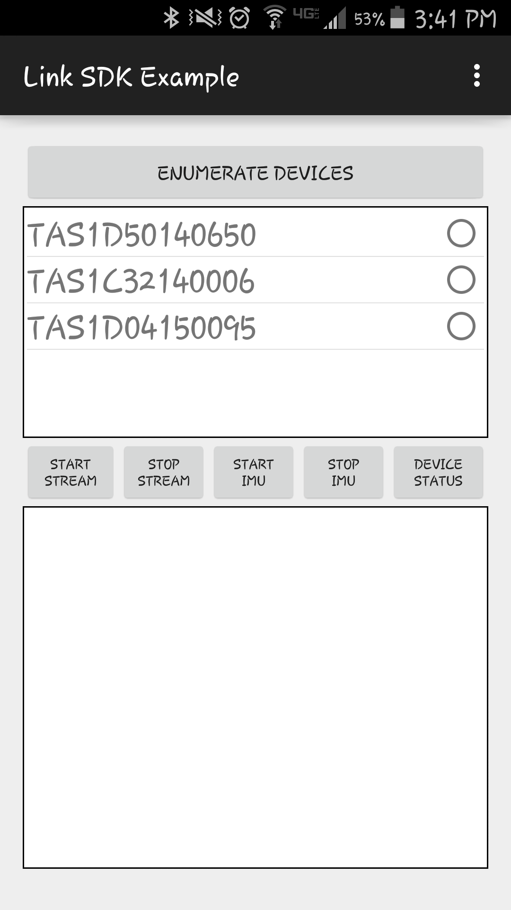
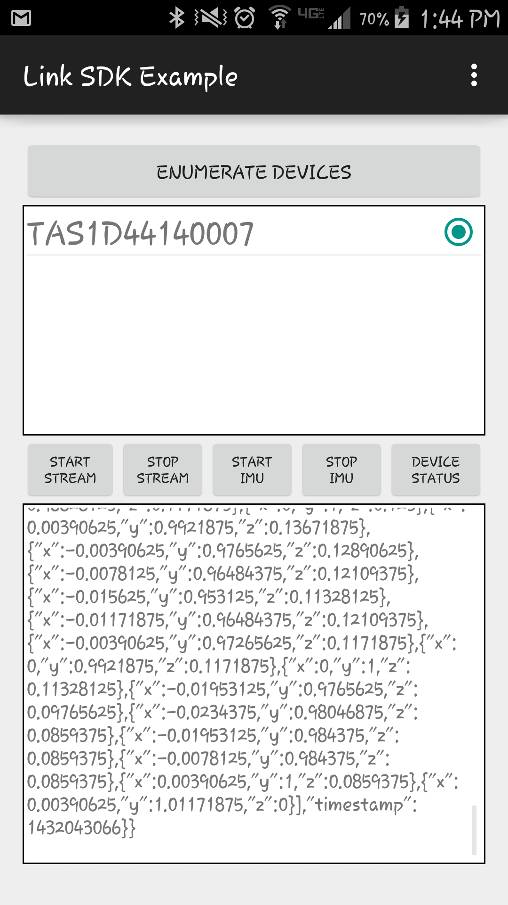

## ActiGraph Link SDK for Mobile Platforms ##

###### 2015-05-18
###### Version 1.0 Technical overview


#### Introduction ####
The Actigraph Link Software Development Kit (SDK) for mobile platforms allows the researcher community to build solutions for their use cases on top of the Actigraph core technologies.  
The SDK works with the ActiGraph Link activity monitors and leverages the BlueTooth LE wireless protocol.


#### What can I do with the Link SDK? ####

- Connect with Link activity monitors from a mobile device via BT LE wireless
- Enable streaming of raw accelerometer data (30 - 100 Hz)
- Configure (enable/disable) the monitor's embedded sensors
       * Accelerometer
       * Gyroscope
       * Magnetometer
       * Temperature

#### Using the Mobile SDK ####


1. Obtain the SDK from GitHub:
	* Actigraph Link SDK is available for Android (minimum supported version is 4.3 (API Level 18)) [https://github.com/actigraph/ActigraphLinkSDK](https://github.com/actigraph/ActigraphLinkSDK "Actigraph Link SDK and sample app")
	* Actigraph Link SDK for IOS (Not available at this time)
2. Obtain Actigraph Link activity monitors and an ActiGraph CentrePoint Account:
	* Contact sales@actigraphcorp.com to set up your CentrePoint account
	* Be sure to request that Link SDK is enabled 
	* The Link monitors will require a minimum firmware level of 1.2.2
3. Consult example application and API documentation:
	* [AGDeviceLibrary](AGDeviceLibrary.md)
	* [AGDeviceLibraryListener](AGDeviceLibraryListener.md)
	* Also located at Documents/index.html when downloaded


#### Technical Overview ####

Add the Link SDK to your mobile project and utilize the device library and listener to communicate with ActiGraph Link monitors.  The device library has methods which facilitate establishing connections to Link devices and changing the device configuration.

* [AGDeviceLibrary](AGDeviceLibrary.md)
* [AGDeviceLibraryListener](AGDeviceLibraryListener.md)

The library uses JSON message formatting to further decouple the data layer dependencies from your particular use case.

###### IMU Configuration
```
{
    "imu": {
    	"accelerometer": "disable",
        "gyroscope": "enable",
        "magnetometer": "disable",
		"temperature": "disable"
    }
}
```

Stream raw monitor data to your app in near-realtime

###### Raw Data Stream
```
{
    "raw": {
    	“device”: “TAS1D44140005”,
    	"timestamp": 1427113646,
    	"acceleration": [
      		{
        		"x": 0.0003,
        		"y": 1.0002,
        		"z": 0.0001
      		},
      		{
        		"x": 0.0001,
        		"y": 0.0003,
        		"z": 1.0001
      		}
    	]
  }
}
```

#### Sample Application ####

Actigraph has developed an open-source sample application to help developers get started with the SDK.  Screen images are provided in this section to illustrate the sample app.


######Sample App screen capture of device enumeration

######Sample App screen capture of device status

######Sample App screen capture of raw data streaming


#### Notes ####
* Example application and library created using Android Studio 1.1.0
* API documentation located at Documents/index.html
* Device library used by example application located at LinkSDKExampleApp/libs/agdevicelibrary-release.aar
